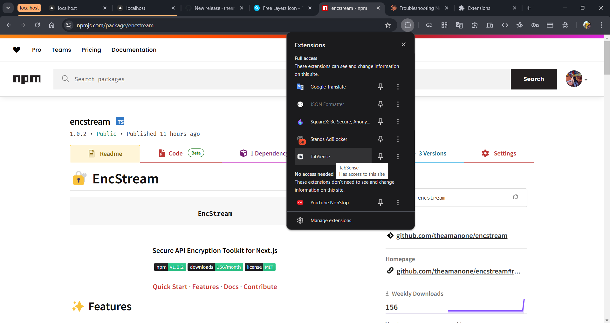

# TabSense - Smart Tab Management Extension

TabSense is an intelligent Chrome extension that helps you manage your browser tabs efficiently using AI-powered insights and smart grouping features.



## ⚡ Quick Install

### Option 1: Direct Installation (.crx)
1. [Download TabSense.crx](https://github.com/theamanone/TabSense/raw/main/releases/TabSense-v1.0.0.crx)
2. Open Chrome and go to `chrome://extensions/`
3. Enable "Developer mode" in the top right
4. Drag and drop the downloaded `.crx` file into the extensions page

### Option 2: Manual Installation (Latest Version)
1. Download this repository:
   ```bash
   git clone https://github.com/theamanone/TabSense.git
   ```
   Or [Download ZIP](https://github.com/theamanone/TabSense/archive/refs/heads/main.zip)

2. Open Chrome and go to `chrome://extensions/`
3. Enable "Developer mode" in the top right
4. Click "Load unpacked" and select the downloaded folder

## 🚀 Features

- **Smart Group**: Automatically group tabs from the same website together
- **Optimize**: Remove duplicate tabs and hibernate inactive ones to save memory
- **Focus Mode**: Group related tabs and minimize others for better focus
- **Task Analysis**: Understand your browsing patterns and optimize workflow
- **Memory Management**: Track and optimize browser memory usage

## 🎯 Usage

1. **Smart Group**
   - Click the Smart Group button to automatically group tabs from the same domain
   - Groups are color-coded for easy identification
   - Groups can be collapsed/expanded for better organization

2. **Optimize**
   - Click Optimize to remove duplicate tabs
   - Inactive tabs will be hibernated to save memory
   - See memory savings in real-time

3. **Focus Mode**
   - Click Focus when working on a specific task
   - Related tabs will be grouped together
   - Other tabs will be minimized for better focus

4. **Settings**
   - Configure auto-grouping behavior
   - Set inactive tab timeout
   - Choose focus mode behavior
   - Manage analytics collection

## 🔒 Privacy

TabSense respects your privacy:
- No data is sent to external servers
- All analysis is done locally in your browser
- Analytics can be disabled in settings
- You can reset all data at any time

## 🛠️ Development

### Prerequisites
- Chrome Browser
- Basic understanding of JavaScript and Chrome Extension APIs

### Setup for Development
1. Clone the repository:
```bash
git clone https://github.com/theamanone/TabSense.git
```

2. Load the extension in Chrome:
- Open `chrome://extensions/`
- Enable "Developer mode"
- Click "Load unpacked"
- Select the extension directory

### Contributing
1. Fork the repository
2. Create your feature branch (`git checkout -b feature/AmazingFeature`)
3. Commit your changes (`git commit -m 'Add some AmazingFeature'`)
4. Push to the branch (`git push origin feature/AmazingFeature`)
5. Open a Pull Request

## 📝 License

This project is licensed under the MIT License - see the [LICENSE](LICENSE) file for details.

## 📧 Contact

Aman - [@theamanone](https://github.com/theamanone)

Project Link: [https://github.com/theamanone/TabSense](https://github.com/theamanone/TabSense)

## ⭐ Support

If you find TabSense useful, please consider:
- Giving it a star on GitHub ⭐
- Sharing it with friends and colleagues
- Contributing to its development
- Reporting any issues or suggesting features